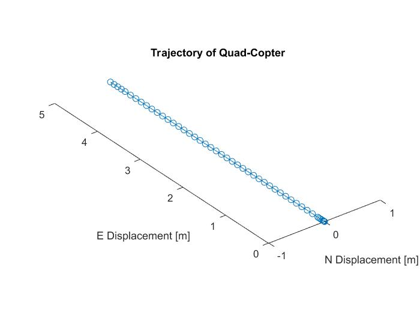

# Aircraft Dynamics 2

## Problem 9:
For this question we were asked to simulate the trajectory of a quad-copter including the azimuth, elevation and bank Euler angle attitude representation. This model includes all forces and moments produced by the quad-copter's four motors in conjunction to all aerodynamic and gravitational effects. This question also asks if the trajectory would change if there were no aerodynamic forces, in which it would not since the forces of drag do not act upon an object that has no velocity in any direction. The following is a representation of the quad-copter in steady hovering flight.

  

## Problem 10:
For this question we were asked to delve into the process of finding the trim state that would give the quad copter a constant velocity of 5 meters per second in the east direction if the body coordinate frame has an azimuth of 0 degrees. We then had find a trim state that gives the quad copter a constant velocity of 5 meters per second east, but this time with an azimuth of 90 degrees. The two results gave the same plots as was requested by the question so only one plot is given. The difference in azimuth ultimately only affected the orientation of the trim state values - where the affected values were the body fixed velocities and Euler angles. The derivations, plot, and code are provided:

  

  

  

  

## Problem 11:
To determine the stability of a quad copter in steady hovering flight with no control inputs, it was necessary to see what the quad-copter would do when there were small disturbances due to the imperfect nature of air conditions, forces from each of the motors and attitude. To see what would happen, the simulation was ran with a normal distribution of random numbers chosen to replicate the small disturbances around initial conditions that should have been zero. The corresponding plots resulted from the small perturbations about the hovering trim state with no controls. When simulating the stability of the quad-copter at a hovering trim state, with fixed controls it was noticed to be unstable. It was noticed that the quad-copter did not return to its original state or even a state of control, therefore the quad-copter is noted to be unstable at this fixed control hovering state. 

  

Lastly, to show how the stability of a hovering quad-copter with no controls is unstable we tested with a PARROT mini quad-copter that had sensors attached and recorded data on the translation and orientation of the quad-copter as a function of time as well as the motor controls. As can be seen in the figures below - the quad-copters became unstable after the controls were turned off. It took a small moment in time for the variations in conditions to effect the state of the quad-copter, but once the small perturbations occurred - the copter could not correct itself since the controls were off. The translation and orientation change drastically and the quad-copter crashes - all due to the unstable trim state once the controls were off. These plots illustrate this below: 

\begin{figure}[H]
\centering
\includegraphics[width=\textwidth]{AircraftTranslation.jpg}
\end{figure}

  

